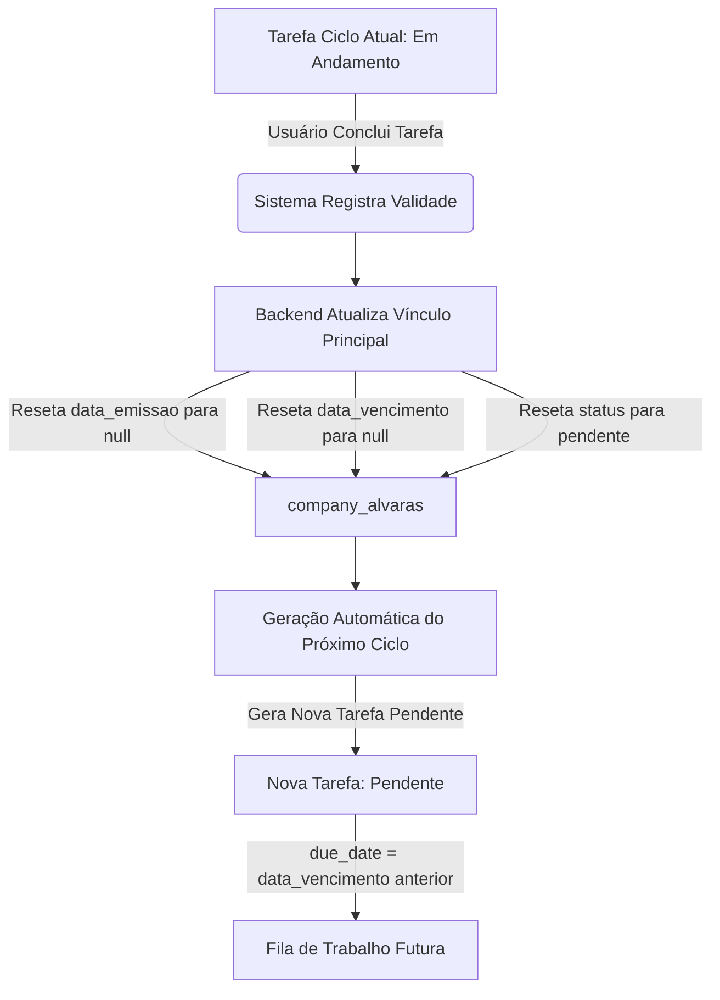

# 🛡️ Regras de Negócio — Gestão e Monitoramento de Alvarás

Este documento reúne todas as especificações e regras de negócio estruturadas no portal, servindo como a **fonte única de verdade** para o funcionamento lógico das datas, do quadro de acompanhamento, do ciclo de vida das tarefas e dos indicadores analíticos do painel executivo.

---

## 📌 1. Mapeamento de Status Dinâmicos (Tempo Real)

O status exibido em cada alvará não é estático no banco de dados. Ele é calculado dinamicamente pelo sistema (`src/lib/utils.ts`) a cada renderização, cruzando os dados do vínculo (`company_alvaras`) com o estado da tarefa associada (`alvara_tasks`).

Existem **11 status dinâmicos** mapeados:

| Status Visual | Regra de Cálculo | Significado Operacional |
| :--- | :--- | :--- |
| **`🚨 Pendente - Vencida`** | Vínculo sem data de emissão e cuja data limite de configuração (`inicio_obrigatorio_ate`) expirou **OU** tarefa não concluída cuja data limite expirou. | O prazo regulamentar para configurar o alvará ou iniciar o processo expirou. Ação imediata necessária. |
| **`⏳ Pendente - Não definida (restam X dias)`** | Vínculo sem datas cadastradas, mas o prazo limite para configuração (`inicio_obrigatorio_ate`) ainda está no futuro. | O alvará foi vinculado à empresa, mas suas datas reais (emissão/vencimento) ainda não foram preenchidas. |
| **`⏳ Pendente - Não definida (hoje é o limite)`** | Vínculo sem datas cadastradas, e a data limite de configuração é a data atual (`hoje`). | Último dia útil para a equipe cadastrar as informações do documento. |
| **`⏳ Pendente - Vence em X dias`** | Tarefa em fase inicial (`pendente`), com validade cadastrada, e faltam menos de 30 dias para o vencimento. | Alerta preventivo de vencimento iminente. |
| **`🛡️ Válido até DD/MM/AAAA`** | Tarefa em fase inicial ou concluída, e a data de vencimento do alvará é futura (superior a 30 dias). | Documento regularizado e operando em total segurança. |
| **`🟠 Em Andamento - Vencido`** | Tarefa na coluna *Em Andamento*, mas a data de vencimento do alvará já passou (`due_date < hoje`). | O processo de renovação foi iniciado, mas o alvará anterior expirou antes da emissão do novo. |
| **`🟢 Em Andamento`** | Tarefa na coluna *Em Andamento* com data de vencimento futura. | O processo de renovação está sendo ativamente trabalhado dentro do prazo de vigência. |
| **`✅ Concluída`** | Tarefa na coluna *Concluído* com data de vencimento futura. | O alvará foi obtido com sucesso e está plenamente válido. |
| **`✅ Concluído - Vencido`** | Tarefa na coluna *Concluído*, mas a data de vencimento associada já expirou. | O alvará foi emitido no passado, mas seu período de vigência já expirou. |
| **`❌ Cancelada`** | Tarefa movida para a coluna *Canceladas*. | O processo foi descontinuado (ex: encerramento da atividade ou dispensa legal do documento). |

---

## 🗂️ 2. Quadro de Acompanhamento (Kanban & Swimlanes)

O módulo de acompanhamento operacional organiza as tarefas através de um quadro Kanban dinâmico e flexível.

### 2.1 Colunas do Kanban
As tarefas transitam entre **5 raias verticais (colunas)** que representam a maturidade do processo:
1.  **`Pendente` (Não Iniciada)**: O alvará está cadastrado, mas a renovação ou emissão ainda não foi iniciada.
2.  **`Em Andamento`**: O despachante ou equipe interna está ativamente providenciando as vistorias, taxas ou documentos.
3.  **`Com Impedimento`**: O processo está travado por pendências externas (ex: exigência da prefeitura, falta de assinatura do cliente, taxas pendentes de pagamento).
4.  **`Concluído`**: O alvará foi emitido e anexado ao sistema.
5.  **`Canceladas`**: O processo foi cancelado.

### 2.2 Persistência das Colunas (Lanes)
O posicionamento de cada cartão nas colunas Kanban é mantido no lado do cliente por meio de armazenamento local (`localStorage`), utilizando a chave `"notifique-acompanhamento-lanes"`. Isso permite alta performance e flexibilidade de arrastar e soltar sem exigir escritas pesadas ou colunas extras de layout no banco de dados.

### 2.3 Raias Horizontais (Swimlanes)
O Kanban suporta **agrupamentos horizontais** em tempo real:
*   **Por Empresa**: Cria raias dedicadas a cada cliente, facilitando a visualização da carteira documental completa por CNPJ.
*   **Por Responsável**: Agrupa as tarefas pelo colaborador designado, ideal para balanceamento de carga de trabalho e gestão de metas da equipe.
*   *Os estados expandidos/recolhidos de cada raia horizontal são memorizados no navegador via chave `"notifique-acompanhamento-collapsed-swimlanes"`.*

---

## 🔄 3. Ciclo de Renovação Automática (Fluxo Preventivo)

Para garantir que a empresa nunca fique desprotegida, a aplicação implementa um modelo de **renovação preventiva de ciclo contínuo**:

### Regras do Gatilho:
1.  Quando uma tarefa é concluída (`status = 'concluida'`), o backend calcula a validade do documento recém-conquistado.
2.  Para abrir caminho para o monitoramento do próximo ano, o vínculo principal (`company_alvaras`) é preventivamente resetado no banco:
    *   `data_emissao = null`
    *   `data_vencimento = null`
    *   `status = "pendente"`
3.  **Geração Preventiva**: O backend cria imediatamente uma **nova tarefa** com status `"pendente"` com vencimento (`due_date`) definido exatamente para o vencimento do alvará que acabou de ser concluído. 
4.  *Dessa forma, o ciclo futuro já entra na fila de planejamento de forma transparente.*

---

## 📊 4. Indicadores do Dashboard e Conformidade Geral

O dashboard consolida as estatísticas com base nos dados reais e nos parâmetros operacionais.

### 4.1 Conformidade Geral (Compliance Rate)
O indicador principal de saúde da carteira é medido em percentual (`0% a 100%`) e segue a seguinte fórmula:

$$\text{Índice de Conformidade} = \left( \frac{\text{Empresas em Conformidade}}{\text{Total de Empresas Ativas}} \right) \times 100$$

*   **Empresas Ativas**: Todas as empresas cadastradas no portal que não estejam arquivadas (`archived_at IS NULL`).
*   **🟢 Em Conformidade (Regular)**: Uma empresa é considerada em conformidade se possuir **pelo menos 1 alvará monitorado** e **0 alvarás vencidos**.
*   **🔴 Crítica (Com Pendência)**: Uma empresa que possui **1 ou mais alvarás vencidos**.
*   **⚪ Não Monitorada (Sem Alvarás)**: Uma empresa ativa, mas que **não possui nenhum alvará cadastrado** em seu portfólio. *Esta empresa não entra no cálculo de conformidade para não inflar artificialmente a saúde do painel.*

### 4.2 Lógica Analítica de "Alvarás Ativos" (Tempo Real - Opção B)
Devido ao ciclo de renovação preventiva (que zera o status no banco para `"pendente"` para planejar o ano seguinte), calculamos os **Alvarás Ativos** cruzando as informações em tempo real no servidor:

Um alvará é computado e exibido como **Ativo (Emitido)** se:
1.  O status do seu vínculo no banco for `"emitido"`.
2.  **OU** se o status do seu vínculo for `"pendente"`, mas houver uma **tarefa concluída vigente** (`status = 'concluida'`) cuja data de validade (`due_date`) ainda esteja no futuro (`due_date >= hoje`).

> [!TIP]
> Graças a essa regra inteligência analítica em memória, empresas com alvarás válidos não aparecem com `"0 Ativos"` durante o ciclo de planejamento futuro.

---

## 🗓️ 5. Cálculo de Datas de Vencimento e Prazos

O sistema prevê alta flexibilidade de parametrização para as datas limites de cada documento.

### 5.1 Frequências de Renovação Suportadas
As periodicidades regulamentares de vigência de alvará são configuráveis no cadastro:
*   `mensal` (1 mês)
*   `bimestral` (2 meses)
*   `trimestral` (3 meses)
*   `semestral` (6 meses)
*   `anual` (1 ano)
*   `bienal` (2 anos)
*   `trienal` (3 anos)
*   `quadrienal` (4 anos)
*   `quinquenal` (5 anos)
*   `personalizada` (Exige input manual de datas pelo usuário)

### 5.2 Ajustes de Fim de Semana (Weekend Adjust)
Para evitar que prazos regulamentares expirem em dias não úteis, o sistema recalcula as datas finais automaticamente:
*   **`no_adjust`**: Mantém a data exata calculada pela frequência.
*   **`previous_business_day`**: Se a data calculada cair em um Sábado ou Domingo, move o prazo limite para a **Sexta-feira anterior**.
*   **`next_business_day`**: Se a data calculada cair em um Sábado ou Domingo, move o prazo limite para a **Segunda-feira seguinte**.

### 5.3 Prazo de Início (`prazo_inicio_dias`)
Parâmetro numérico (padrão: 30 dias) definido no tipo de alvará que dita com quantos dias de antecedência a tarefa de renovação deve ser destacada e iniciada antes do vencimento real do documento anterior.
